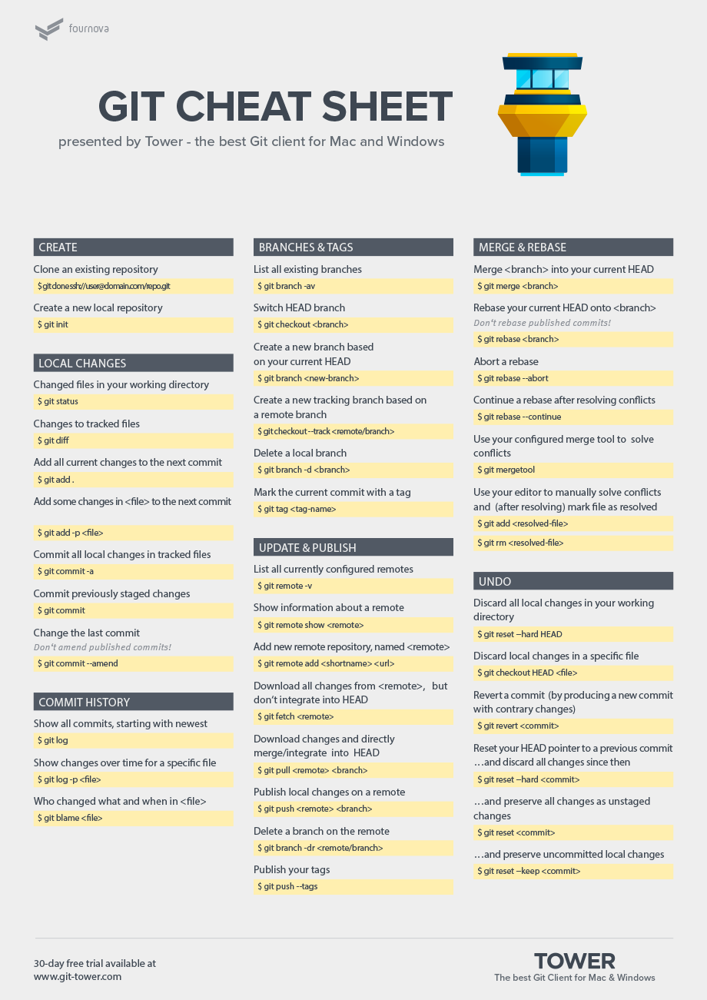

# Git Commands  
#### [<--Back to Home](../Readme.md)

### Basic Git/GitHub Cheat Sheet
#### The Beginner's Guide to Version Control

Setting up Git  Identity

```
$ git config --global user.name "John Doe"

$ git config --global user.email johndoe@example.com
```
Add a File to Git

```
$git add . //will add everything

$git add filename.extension

$git add  *.html
```

Show Whats on the Staging area

```
$git status
```

Remove a File from Staging area 

```
$git reset filename.extension
```

Changing the Remote URL for Git repo

```
$ git remote set-url origin https://github.com/USERNAME/REPOSITORY.git
```

Remove File from Staging Area and Set it to be Untracked

```
$git rm --cached filename.extension
```
Checking Settings
```
git config --list
```

Create a new branch with git and manage branches
```
$git branch branchname
```


Before creating a new branch, pull the changes from upstream. Your master needs to be up to date.

```
$ git pull
```
Create the branch on your local machine and switch in this branch :
```
$ git checkout -b [name_of_your_new_branch]    //or
$ git checkout "branchname"

```
While Inside Master take the commits from the your branch and merge them to the main Repository

```
$ git merge branchname
```
Push the branch on github :

```
$ git push origin [name_of_your_new_branch]
```

## Git Cheat Sheet 



